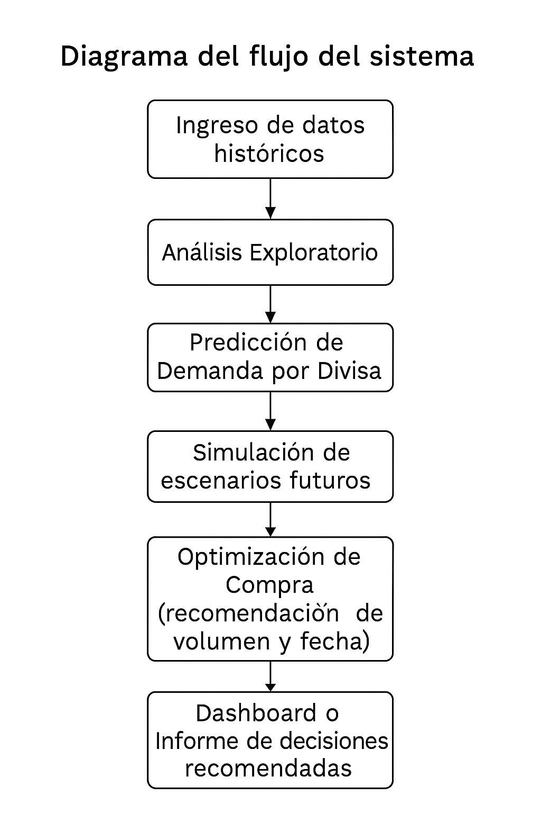

# Rah-Jos-Jac-Proyecto-fin-de-curso


# Sistema de Predicción y Optimización de Compras de Divisas


Este proyecto desarrolla un sistema para anticipar la demanda de divisas y la evolución del tipo de cambio, con el fin de optimizar las decisiones de compra en una empresa de cambio de moneda.

## Objetivos

- Predecir la cantidad de cada divisa que se requerirá en los próximos días/semanas  
- Estimar el tipo de cambio futuro entre divisas clave  
- Sugerir cuándo y cuánto comprar para maximizar rentabilidad  
- Simular estrategias pasadas para cuantificar impacto (backtesting)

---

## Estructura del repositorio

```bash
notebooks/
├── 00_setup_importacion.ipynb
├── 01_exploracion_datos.ipynb
├── 02_modelo_demanda_divisas.ipynb
├── 03_modelo_tipo_de_cambio.ipynb
├── 04_optimizar_compra_divisas.ipynb
├── 05_simulacion_backtesting.ipynb
├── 06_dashboard_resultados.ipynb
├── 07_informe_presentacion.ipynb

data/              → Datos crudos y limpios (CSV, Excel, etc.)
reports/           → Predicciones, resultados, gráficas, dashboards
executed/          → Cuadernos ejecutados con resultados visibles
scripts/           → Código para descargas automáticas y utilidades
src/               → Funciones auxiliares reutilizables (opcional)
launcher.py        → Lanza todos los notebooks en orden con papermill
requirements.txt   → Librerías necesarias
README.md          → Este archivo
```


## 🧭 Diagrama del flujo del sistema




---

## ¿Cómo ejecutar el proyecto?

1. Instala las dependencias necesarias:

```bash
pip install -r requirements.txt


